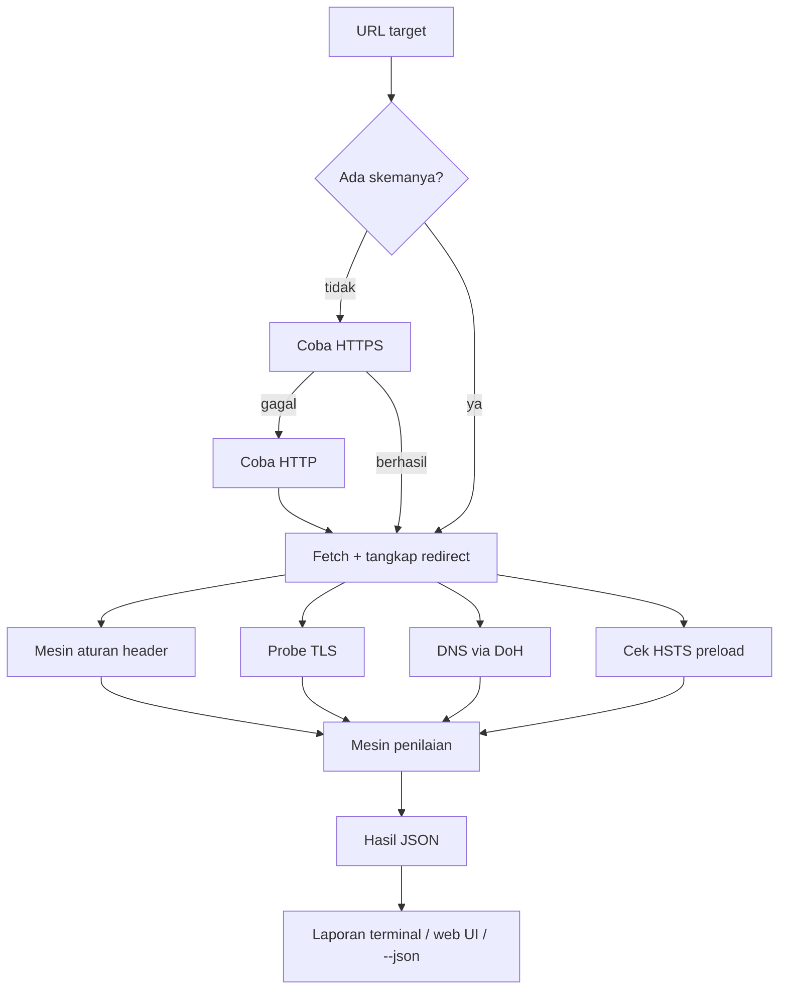
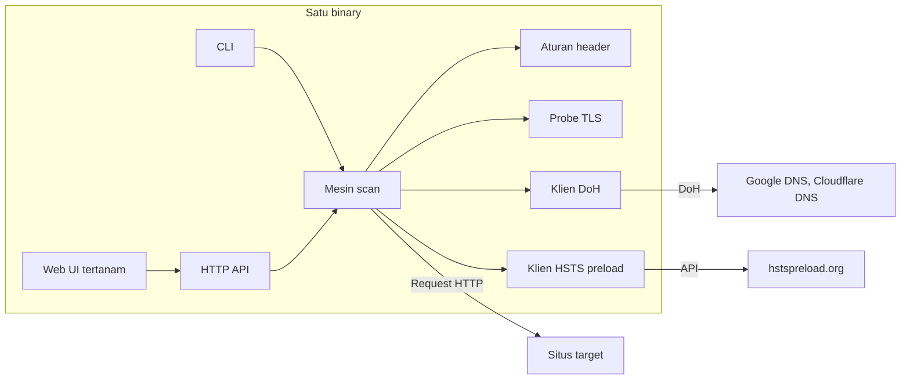
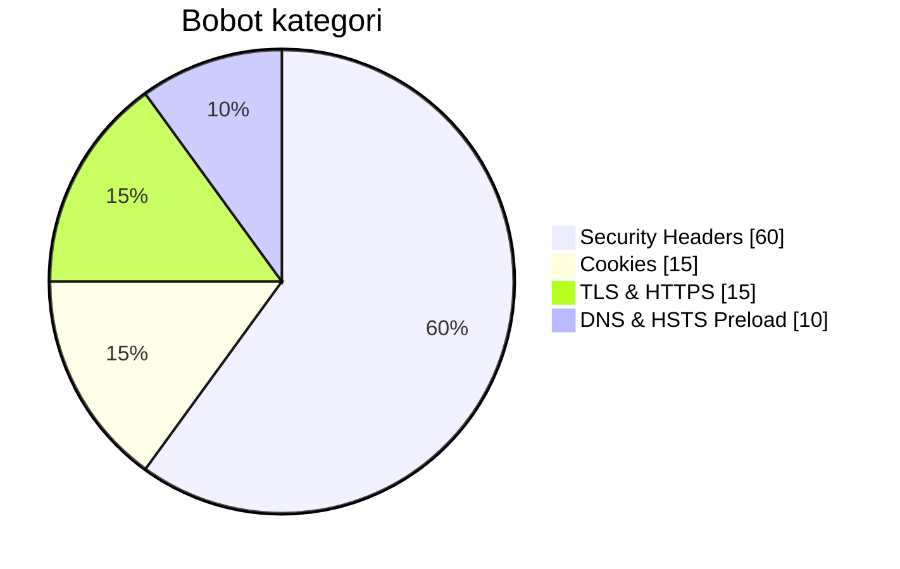

# HeaderGuard

Alat analisis keamanan header web. Beri sebuah URL, dan HeaderGuard akan
memeriksa header keamanan, cookie, konfigurasi TLS, rantai redirect, record
DNS, dan status HSTS preload situs tersebut, lalu memberi nilai dari A+
sampai F.

HeaderGuard adalah satu binary Go statis. Di dalamnya sudah tertanam web UI
dan mode CLI, hanya memakai pustaka standar, tanpa dependensi runtime. Alat
ini berawal dari halaman uji clickjacking sederhana — simulasi iframe
aslinya masih ada, di tab Clickjacking.

> Dokumentasi tersedia dalam: [English](README.md) | **Bahasa Indonesia** (halaman ini)

> **Hanya untuk pengujian yang diizinkan.** Gunakan HeaderGuard pada sistem
> milik sendiri atau yang Anda punya izin eksplisit untuk mengujinya. Alat
> ini memang dirancang untuk memindai host internal (untuk audit mandiri),
> jadi jangan mengeksposnya ke internet publik tanpa proteksi, dan jangan
> dipakai untuk aktivitas ilegal.

---

## Yang diperiksa

| Modul | Keterangan |
|---|---|
| Security Headers | 21 aturan header: Content-Security-Policy, Strict-Transport-Security, X-Frame-Options, X-Content-Type-Options, Referrer-Policy, Permissions-Policy, COOP / CORP / COEP, kebocoran info server, Cache-Control, CORS, dan lainnya. Tiap aturan mendapat status (OK, peringatan, hilang), penjelasan, dan saran perbaikan. |
| Clickjacking | Verdict dari sisi server berdasarkan X-Frame-Options dan CSP `frame-ancestors`, plus simulasi iframe interaktif yang asli (muat situs di frame, toggle transparansi dan tombol overlay palsu). |
| Cookies | Mengurai setiap `Set-Cookie` di seluruh rantai respons dan memeriksa flag `Secure`, `HttpOnly`, dan `SameSite` per cookie. `SameSite=None` tanpa `Secure` dianggap temuan fatal. Nilai cookie tidak pernah disimpan atau ditampilkan. |
| TLS & HTTPS | Memeriksa versi TLS yang diterima server (1.0 sampai 1.3) dan memeriksa sertifikat: kedaluwarsa, issuer, subject, SAN, algoritma signature, validitas rantai, dan kecocokan hostname. |
| Redirects | Mengikuti rantai redirect hop demi hop (maksimal 10), mencatat status code, perubahan skema, dan cookie per hop. Mendeteksi loop dan downgrade https→http. |
| DNS | Query CAA, SPF, DMARC, dan DNSSEC (flag AD) lewat DNS-over-HTTPS, dengan Google sebagai resolver utama dan Cloudflare sebagai fallback. Bila host tidak punya record sendiri, lookup menelusuri parent domain (maksimal dua level) sehingga kebijakan level apex diterapkan secara adil pada scan subdomain. |
| HSTS Preload | Mengecek status domain di [hstspreload.org](https://hstspreload.org) bila header HSTS valid ditemukan. |
| Nilai & Laporan | Menghitung skor 0–100 dengan nilai huruf per kategori, dan mengekspor hasil lengkap sebagai JSON atau Markdown. Web UI juga menyimpan riwayat lokal dan mendukung tautan berbagi. |

## Cara kerja

Sebuah scan berjalan dalam dua fase. Pertama, HeaderGuard mengambil target
dan menangkap rantai redirect-nya. Respons akhir lalu diberikan ke mesin
aturan header, parser cookie, dan verdict clickjacking. Setelah itu, tiga
pemeriksaan independen berjalan paralel: probing TLS, lookup
DNS-over-HTTPS, dan status HSTS preload. Semua hasil digabung menjadi satu
dokumen JSON, dinilai, lalu ditampilkan — di terminal, di web UI, atau
sebagai JSON mentah untuk scripting.



<!-- Jika platform Anda tidak merender Mermaid, tempel gambar hasil ekspor di sini,
     mis.  -->

Susunan binary-nya seperti ini:



<!-- Jika platform Anda tidak merender Mermaid, tempel gambar hasil ekspor di sini,
     mis.  -->

## Instalasi

Butuh Go 1.22 atau lebih baru untuk build dari source.

```bash
go build -o headerguard .
```

Hasilnya satu binary statis. Salin ke mana saja — Linux, macOS, dan Windows
semuanya didukung.

Docker juga didukung:

```bash
# Build lokal
docker build -t headerguard .
docker run --rm -p 8080:8080 headerguard

# Atau dengan Compose
docker compose up
```

Lalu buka http://localhost:8080.

## Penggunaan

### Web UI

```bash
./headerguard                              # melayani UI di 127.0.0.1:8080
./headerguard serve --addr 0.0.0.0:8080   # bind ke semua interface
```

Masukkan URL lalu tekan Scan. Hasilnya terbagi dalam sembilan tab: Summary,
Security Headers, Clickjacking, Cookies, TLS, Redirects & HTTPS, DNS, HSTS
Preload, dan Report.

Beberapa hal yang perlu diketahui tentang UI-nya:

* Tautan berbagi: `http://localhost:8080/?target=example.com` otomatis
  menjalankan scan saat halaman dibuka.
* 20 scan terakhir tersimpan di localStorage browser. Klik salah satu entri
  untuk memindai ulang.
* Tab Report bisa mengekspor hasil sebagai JSON atau Markdown, menyalinnya
  ke clipboard, atau membuat tautan berbagi.

### CLI

```bash
# Scan tunggal, laporan terminal berwarna
./headerguard scan example.com              # tanpa skema pun bisa: HTTPS dicoba dulu
./headerguard scan subdomain.example.com

# Output JSON untuk scripting
./headerguard scan example.com --json | jq .grade

# Simpan laporan
./headerguard scan example.com --output report.txt

# Mode batch dengan worker paralel
./headerguard scan --batch targets.txt --workers 10
./headerguard scan --batch targets.txt --json --output results.ndjson
```

Flag untuk `scan`:

| Flag | Default | Keterangan |
|---|---|---|
| `--json` | mati | Output JSON |
| `--output FILE` | — | Tulis laporan ke FILE |
| `--timeout DETIK` | 30 | Timeout per fase |
| `--follow-redirects` | `true` | Ikuti redirect (maksimal 10 hop) |
| `--no-color` | mati | Matikan warna ANSI |
| `--batch FILE` | — | File berisi satu target per baris (`#` untuk komentar) |
| `--workers N` | 5 | Worker paralel untuk `--batch` |
| `--scheme auto\|https\|http` | `auto` | Skema yang dipakai bila target tidak berskema |

Exit code: `0` sukses, `1` scan gagal total, `2` kesalahan pemakaian.

### HTTP API

Web UI memakai dua endpoint:

```
GET  /api/health        -> {"status":"ok","version":"1.0.0"}
POST /api/scan          -> hasil scan lengkap dalam JSON
```

Contoh permintaan scan:

```bash
curl -s -X POST http://127.0.0.1:8080/api/scan \
     -H 'Content-Type: application/json' \
     -d '{"target":"https://example.com","timeout_seconds":30,"follow_redirects":true}'
```

Responsnya satu dokumen JSON berisi `meta`, `grade`, `headers`,
`clickjacking`, `cookies`, `tls`, `redirects`, `dns`, dan `hsts_preload`.
Scan yang selesai selalu mengembalikan HTTP 200; bila fetch awal gagal,
dokumennya memuat `meta.status: "error"`, sementara kegagalan tingkat modul
(misalnya timeout TLS) diisolasi di bagian modul tersebut.

## Aturan header keamanan

Mesin header menerapkan 13 aturan bernilai (total 60 poin) ditambah 8 aturan
informasional yang tidak memengaruhi nilai.

| Header | Poin | Yang dianggap OK | Yang dianggap peringatan |
|---|---|---|---|
| Content-Security-Policy | 12 | Directive ketat, `frame-ancestors`, `object-src 'none'`, `base-uri`, `upgrade-insecure-requests`, tanpa `unsafe-inline`/`unsafe-eval` | Wildcard `*`, keyword `unsafe-*`, beberapa header, hanya meta CSP |
| Strict-Transport-Security | 8 | `max-age` >= 6 bulan, `includeSubDomains`, `preload` | `max-age` pendek, tanpa `includeSubDomains`, `max-age=0`, header invalid |
| X-Frame-Options (+ CSP `frame-ancestors`) | 8 | `DENY`/`SAMEORIGIN`, atau `frame-ancestors` ketat | `ALLOW-FROM` (diabaikan browser modern), konflik, wildcard |
| X-Content-Type-Options | 5 | `nosniff` | Token tambahan, nilai selain `nosniff` |
| Referrer-Policy | 5 | `no-referrer`, `strict-origin`, `strict-origin-when-cross-origin` | Kebijakan sedang/lemah, beberapa header, token tak dikenal |
| Permissions-Policy | 5 | Tanpa wildcard pada camera, microphone, geolocation, payment, USB | `*` pada fitur sensitif |
| Cross-Origin-Opener-Policy | 4 | `same-origin` | `same-origin-allow-popups`, `unsafe-none`, nilai invalid |
| Cross-Origin-Resource-Policy | 3 | `same-origin`/`same-site` | `cross-origin`, nilai invalid |
| Cross-Origin-Embedder-Policy | 2 | `require-corp`/`credentialless` | `unsafe-none`, nilai invalid |
| Kebocoran info server | 3 | Tanpa `Server`, `X-Powered-By`, dll. | Salah satu header itu ada |
| Cache-Control | 3 | `no-store` | `public`/`max-age`, hilang |
| Access-Control-Allow-Origin | 2 | Tidak ada atau origin spesifik | `*`, `null`, wildcard digabung dengan cookie |

Aturan informasional (bobot 0): X-XSS-Protection, Expect-CT, Feature-Policy,
varian CSP lawas, P3P, Clear-Site-Data, CSP-Report-Only, dan charset
Content-Type.

Beberapa header ditangani sesuai standar bila relevan: beberapa header CSP
digabung mengikuti CSP3, nilai X-Frame-Options yang saling bertentangan
menghasilkan peringatan, dan header Referrer-Policy ganda ditandai karena
browser memakai yang terakhir.

## Penilaian

Skor dihitung `100 * didapat / berlaku`, dengan kategori yang tidak berlaku
dikeluarkan dari kedua jumlah. Situs tanpa cookie, misalnya, dinilai dari
tiga kategori lainnya, bukan dihukum karena 15 poin yang hilang.



<!-- Jika platform Anda tidak merender Mermaid, tempel gambar hasil ekspor di sini,
     mis.  -->

| Skor | Nilai |
|---|---|
| >= 95 | A+ |
| >= 85 | A |
| >= 70 | B |
| >= 55 | C |
| >= 40 | D |
| >= 25 | E |
| < 25 | F |

Di dalam tiap kategori: setiap header mendapat sebagian poinnya; cookie
mendapat hingga 3 poin per cookie (Secure, HttpOnly, SameSite) yang
dirata-ratakan di seluruh rantai; TLS dinilai dari penegakan HTTPS, versi
protokol, kedaluwarsa sertifikat, dan verifikasi rantai; DNS dinilai dari
DNSSEC, CAA, SPF, DMARC, dan status preload.

Hanya ada satu cap keras: cookie `SameSite=None` tanpa `Secure` adalah
kesalahan konfigurasi fatal, sehingga nilai dibatasi maksimal B, apa pun
hasil lainnya.

## Catatan metodologi

Beberapa detail implementasi yang memengaruhi cara membaca hasil:

* Fetch HTTP sengaja memakai `InsecureSkipVerify`. Situs dengan sertifikat
  rusak tetap dianalisis headernya; kepercayaan sertifikat dinilai terpisah
  oleh modul TLS, yang melakukan handshake terverifikasi sendiri.
* Modul TLS melakukan dua kali koneksi: handshake terverifikasi untuk detail
  sertifikat, dan probe per versi (TLS 1.0 sampai 1.3) untuk membangun
  matriks protokol.
* Pemeriksaan DNS berjalan lewat DNS-over-HTTPS karena resolver standar Go
  tidak bisa mengurai record CAA atau flag AD DNSSEC. Bila Google DNS gagal,
  Cloudflare dicoba otomatis.
* Kebijakan level apex dinilai secara adil untuk subdomain. Lookup CAA, SPF,
  dan DMARC menelusuri parent domain (maksimal dua level) bila host tidak
  punya record sendiri, dan cek HSTS preload mewarisi entri preload dari
  parent domain. Penelusuran CAA sesuai RFC 8659; penelusuran SPF adalah
  heuristik keadilan (SPF tidak punya fallback di spesifikasinya), dan
  keduanya disebutkan di detail hasil bila record parent yang dipakai.
* Cek HSTS preload memanggil API resmi hstspreload.org hanya bila header HSTS
  valid ada; selain itu modul melaporkan N/A.
* Analisis cookie mencakup seluruh rantai redirect, di-deduplikasi per nama
  dengan kemunculan terakhir yang menang.

## Batasan

Didokumentasikan dengan sengaja, tanpa urutan khusus:

* HeaderGuard bisa memindai host internal (`localhost`, alamat RFC1918).
  Itu fitur untuk audit mandiri, tetapi artinya Anda sebaiknya tidak
  mengekspos server ke internet publik. Alamat bind default adalah
  `127.0.0.1`.
* Verdict clickjacking berasal dari header respons. Simulasi iframe di UI
  hanya alat bantu visual — apakah frame benar-benar diblokir tidak bisa
  dideteksi secara andal dari JavaScript.
* Nama domain internasional tidak didukung; gunakan punycode.
* Versi TLS di bawah 1.0 (SSLv3 dan yang lebih lama) tidak diuji, karena
  `crypto/tls` Go dimulai dari TLS 1.0.
* DNSSEC hanya diverifikasi lewat flag AD dari resolver DoH; rantai DS tidak
  ditelusuri sendiri.
* Meta CSP di HTML dideteksi dan dilaporkan, tetapi tidak dihitung sebagai
  header CSP (dan tidak bisa melindungi dari framing).
* Tidak ada public-suffix list, jadi penelusuran parent domain adalah
  heuristik: berhenti setelah dua level dan tidak pernah turun di bawah nama
  dua label. Untuk suffix multi-label seperti `co.uk`, ini bisa memicu satu
  query ekstra yang tidak berarti (`co.uk` itu sendiri) — tidak berbahaya,
  hanya satu lookup tambahan.
* Pemeriksaan DNS dan preload membutuhkan akses internet ke Google,
  Cloudflare, dan hstspreload.org. Bila tidak terjangkau, modul terkait
  ditandai N/A dan scan tetap selesai.
* Masalah mixed-content di dalam halaman tidak diperiksa; itu membutuhkan
  browser headless.

## Pengembangan

```bash
go vet ./...
go test ./...
go build -o headerguard .
```

Direktori penting:

```
main.go                  dispatch perintah (serve / scan / version / help)
internal/scanner/        mesin scan: headers, TLS, DNS, HSTS, penilaian
internal/api/            server HTTP: /api/health, /api/scan, file statis
internal/cli/            laporan terminal, warna, batch runner
internal/ui/             web UI tertanam (HTML, CSS, vanilla JS)
```

Menambah aturan header baru berarti menambah satu entri ke `rulesTable()`
di `internal/scanner/headers.go`, dengan fungsi pemeriksa yang
mengembalikan poin, status, penjelasan, dan saran perbaikan. Test untuk
aturan-aturannya ada di `headers_test.go` di package yang sama.

## Referensi

* [OWASP Secure Headers Project](https://owasp.org/www-project-secure-headers/)
* [Mozilla Observatory](https://observatory.mozilla.org/)
* [securityheaders.com](https://securityheaders.com/)
* [hstspreload.org](https://hstspreload.org/)

## Lisensi

[MIT](LICENSE) © 2026 JackTekno
