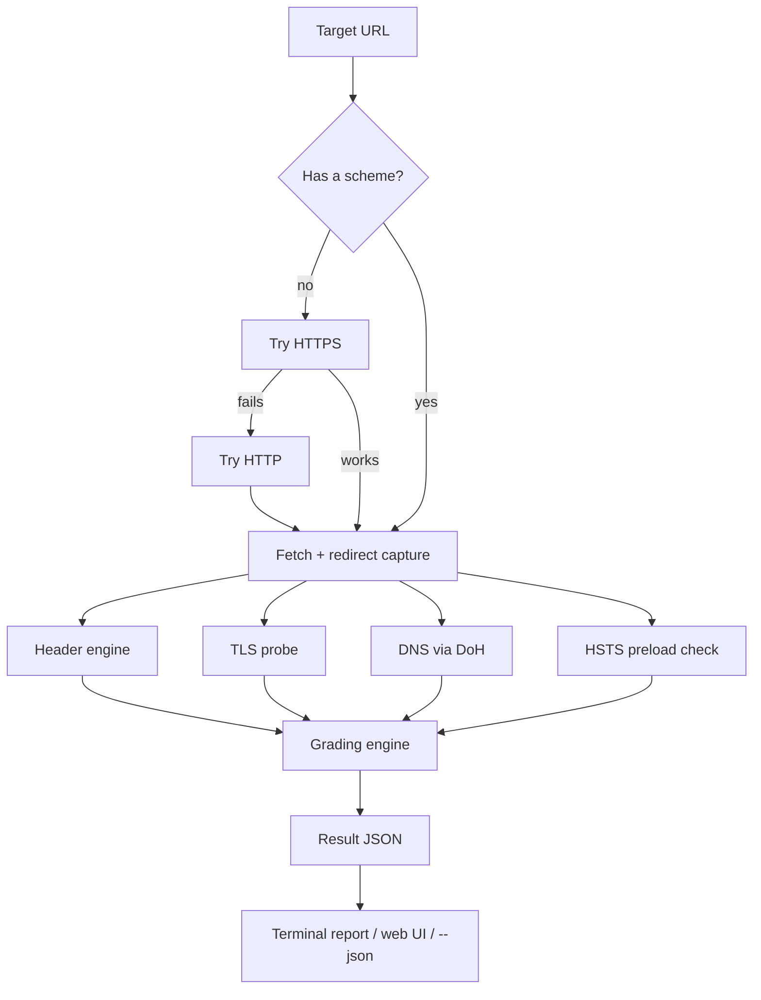
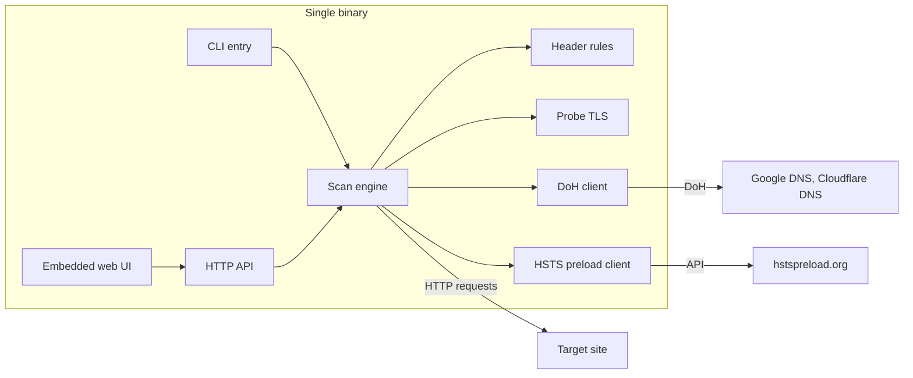
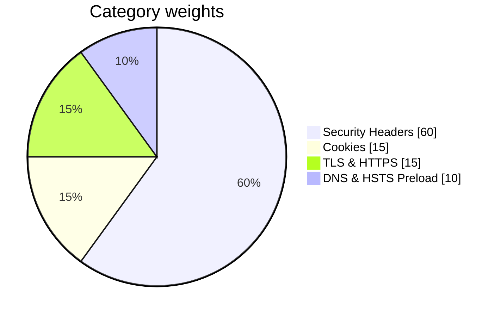

# HeaderGuard

A web security header analysis tool. Give it a URL and it checks the security
headers, cookies, TLS setup, redirect chain, DNS records, and HSTS preload
status of the site, then grades the whole thing from A+ to F.

HeaderGuard is a single static Go binary. It ships with an embedded web UI and
a CLI mode, uses only the standard library, and has no runtime dependencies.
It started out as a small clickjacking test page and grew from there — the
original iframe simulation is still in there, in the Clickjacking tab.

> Documentation available in: **English** (this page) | [Bahasa Indonesia](README.id.md)

> **Authorized testing only.** Use HeaderGuard on systems you own or have
> explicit permission to test. The tool can scan internal hosts by design
> (it is meant for self-audits), so do not expose it to the public internet
> without protection, and do not use it for anything illegal.

---

## What it checks

| Module | What it does |
|---|---|
| Security Headers | 21 header rules: Content-Security-Policy, Strict-Transport-Security, X-Frame-Options, X-Content-Type-Options, Referrer-Policy, Permissions-Policy, COOP / CORP / COEP, server-info disclosure, Cache-Control, CORS, and more. Each rule gets a status (OK, warning, missing), a plain-language explanation, and a suggested fix. |
| Clickjacking | A server-side verdict derived from X-Frame-Options and CSP `frame-ancestors`, plus the original interactive iframe simulation (load the site in a frame, toggle transparency and a fake overlay button). |
| Cookies | Parses every `Set-Cookie` in the response chain and checks the `Secure`, `HttpOnly`, and `SameSite` flags per cookie. `SameSite=None` without `Secure` is treated as a fatal finding. Cookie values are never stored or displayed. |
| TLS & HTTPS | Probes which TLS versions the server accepts (1.0 through 1.3) and inspects the certificate: expiry, issuer, subject, SANs, signature algorithm, chain validity, and hostname match. |
| Redirects | Follows the redirect chain hop by hop (up to 10), recording status codes, scheme changes, and cookies per hop. Detects loops and https→http downgrades. |
| DNS | Queries CAA, SPF, DMARC, and DNSSEC (AD flag) through DNS-over-HTTPS, with Google as the primary resolver and Cloudflare as fallback. When the host has no records of its own, the lookup walks up to the parent domain (up to two levels) so apex-level policies are applied fairly to subdomain scans. |
| HSTS Preload | Checks the domain's status on [hstspreload.org](https://hstspreload.org) when a valid HSTS header is present. |
| Grade & Report | Computes a 0–100 score with a letter grade per category, and exports the full result as JSON or Markdown. The web UI also keeps a local history and supports shareable links. |

## How it works

A scan runs in two phases. First, HeaderGuard fetches the target and captures
the redirect chain. The final response is then handed to the header engine,
the cookie parser, and the clickjacking verdict. After that, three independent
checks run in parallel: TLS probing, DNS-over-HTTPS lookups, and the HSTS
preload status. All results are combined into one JSON document, graded, and
rendered — in the terminal, in the web UI, or as raw JSON for scripting.



<!-- If your platform does not render Mermaid, paste an exported image here,
     e.g.  -->

The binary layout looks like this:



<!-- If your platform does not render Mermaid, paste an exported image here,
     e.g.  -->

## Installation

You need Go 1.22 or newer to build from source.

```bash
go build -o headerguard .
```

This produces a single static binary. Copy it anywhere — Linux, macOS, and
Windows are all supported.

Docker is also supported:

```bash
# Prebuilt-style local build
docker build -t headerguard .
docker run --rm -p 8080:8080 headerguard

# Or with Compose
docker compose up
```

Then open http://localhost:8080.

## Usage

### Web UI

```bash
./headerguard                              # serves the UI on 127.0.0.1:8080
./headerguard serve --addr 0.0.0.0:8080   # bind to all interfaces
```

Enter a URL and press Scan. The result is split across nine tabs: Summary,
Security Headers, Clickjacking, Cookies, TLS, Redirects & HTTPS, DNS, HSTS
Preload, and Report.

A few things worth knowing about the UI:

* Share links: `http://localhost:8080/?target=example.com` runs the scan
  automatically when the page opens.
* The last 20 scans are kept in the browser's localStorage. Click an entry to
  rescan it.
* The Report tab can export the result as JSON or Markdown, copy it to the
  clipboard, or produce a shareable link.

### CLI

```bash
# Single scan, colored terminal report
./headerguard scan example.com              # no scheme needed: HTTPS is tried first
./headerguard scan subdomain.example.com

# JSON output for scripting
./headerguard scan example.com --json | jq .grade

# Save a report
./headerguard scan example.com --output report.txt

# Batch mode with parallel workers
./headerguard scan --batch targets.txt --workers 10
./headerguard scan --batch targets.txt --json --output results.ndjson
```

Flags for `scan`:

| Flag | Default | Description |
|---|---|---|
| `--json` | off | JSON output |
| `--output FILE` | — | Write the report to FILE |
| `--timeout SECONDS` | 30 | Per-phase timeout |
| `--follow-redirects` | `true` | Follow redirects (max 10 hops) |
| `--no-color` | off | Disable ANSI colors |
| `--batch FILE` | — | File with one target per line (`#` starts a comment) |
| `--workers N` | 5 | Parallel workers for `--batch` |
| `--scheme auto\|https\|http` | `auto` | Scheme to use when the target has none |

Exit codes: `0` on success, `1` when the scan failed completely, `2` on usage
errors.

### HTTP API

The web UI talks to two endpoints:

```
GET  /api/health        -> {"status":"ok","version":"1.0.0"}
POST /api/scan          -> full scan result as JSON
```

A scan request looks like this:

```bash
curl -s -X POST http://127.0.0.1:8080/api/scan \
     -H 'Content-Type: application/json' \
     -d '{"target":"https://example.com","timeout_seconds":30,"follow_redirects":true}'
```

The response is a single JSON document containing `meta`, `grade`, `headers`,
`clickjacking`, `cookies`, `tls`, `redirects`, `dns`, and `hsts_preload`.
A completed scan always returns HTTP 200; a scan whose initial fetch failed
carries `meta.status: "error"` inside the document, while module-level
failures (for example, a TLS timeout) are isolated to that module's section.

## Security header rules

The header engine applies 13 scored rules (60 points total) plus 8
informational rules that never affect the score.

| Header | Points | What counts as OK | What counts as a warning |
|---|---|---|---|
| Content-Security-Policy | 12 | Strict directives, `frame-ancestors`, `object-src 'none'`, `base-uri`, `upgrade-insecure-requests`, no `unsafe-inline`/`unsafe-eval` | `*` wildcards, `unsafe-*` keywords, multiple headers, meta CSP only |
| Strict-Transport-Security | 8 | `max-age` >= 6 months, `includeSubDomains`, `preload` | Short `max-age`, missing `includeSubDomains`, `max-age=0`, invalid header |
| X-Frame-Options (+ CSP `frame-ancestors`) | 8 | `DENY`/`SAMEORIGIN`, or strict `frame-ancestors` | `ALLOW-FROM` (ignored by modern browsers), conflicts, wildcards |
| X-Content-Type-Options | 5 | `nosniff` | Extra tokens, values other than `nosniff` |
| Referrer-Policy | 5 | `no-referrer`, `strict-origin`, `strict-origin-when-cross-origin` | Moderate/weak policies, multiple headers, unknown tokens |
| Permissions-Policy | 5 | No wildcards on camera, microphone, geolocation, payment, USB | `*` on sensitive features |
| Cross-Origin-Opener-Policy | 4 | `same-origin` | `same-origin-allow-popups`, `unsafe-none`, invalid values |
| Cross-Origin-Resource-Policy | 3 | `same-origin`/`same-site` | `cross-origin`, invalid values |
| Cross-Origin-Embedder-Policy | 2 | `require-corp`/`credentialless` | `unsafe-none`, invalid values |
| Server-info disclosure | 3 | No `Server`, `X-Powered-By`, etc. | Any of those headers present |
| Cache-Control | 3 | `no-store` | `public`/`max-age`, missing |
| Access-Control-Allow-Origin | 2 | Absent or a specific origin | `*`, `null`, wildcard combined with cookies |

Informational rules (weight 0): X-XSS-Protection, Expect-CT, Feature-Policy,
legacy CSP variants, P3P, Clear-Site-Data, CSP-Report-Only, and the
Content-Type charset.

Multiple headers are handled per spec where it matters: several CSP headers
are combined following CSP3, conflicting X-Frame-Options values produce a
warning, and duplicate Referrer-Policy headers are flagged since browsers use
the last one.

## Scoring

The score is `100 * earned / applicable`, where categories that do not apply
are left out of both sums. A site with no cookies, for example, is graded on
the other three categories instead of being penalized for the missing 15
points.



<!-- If your platform does not render Mermaid, paste an exported image here,
     e.g.  -->

| Score | Grade |
|---|---|
| >= 95 | A+ |
| >= 85 | A |
| >= 70 | B |
| >= 55 | C |
| >= 40 | D |
| >= 25 | E |
| < 25 | F |

Within each category: every header earns a fraction of its points; cookies
earn up to 3 points each (Secure, HttpOnly, SameSite) averaged across the
whole chain; TLS scores on HTTPS enforcement, protocol versions, certificate
expiry, and chain verification; DNS scores on DNSSEC, CAA, SPF, DMARC, and
the preload status.

There is exactly one hard cap: a `SameSite=None` cookie without `Secure` is a
fatal configuration error, so the grade is capped at B regardless of
everything else.

## Methodology notes

A few implementation details that affect how results should be read:

* The HTTP fetch uses `InsecureSkipVerify` on purpose. Sites with broken
  certificates still get their headers analyzed; certificate trust is judged
  separately by the TLS module, which performs its own verified handshake.
* The TLS module dials twice: a verified handshake for certificate details,
  and per-version probes (TLS 1.0 through 1.3) to build the protocol matrix.
* DNS checks run over DNS-over-HTTPS because the Go standard resolver cannot
  parse CAA records or the DNSSEC AD flag. If Google DNS fails, Cloudflare is
  tried automatically.
* Apex-level policies are scored fairly for subdomains. CAA, SPF, and DMARC
  lookups walk up to the parent domain (up to two levels) when the host has
  no records of its own, and the HSTS preload check inherits the parent
  domain's preload entry. CAA walking is per RFC 8659; the SPF walk is a
  fairness heuristic (SPF has no fallback in the spec), and both are noted
  in the check details when a parent record is used.
* The HSTS preload check calls the official hstspreload.org API only when a
  valid HSTS header exists; otherwise the module reports N/A.
* Cookie analysis covers the entire redirect chain, deduplicated by name with
  the last occurrence winning.

## Limitations

Deliberately documented, in no particular order:

* HeaderGuard can scan internal hosts (`localhost`, RFC1918 addresses). That
  is a feature for self-auditing, but it means you should not expose the
  server to the public internet. The default bind address is `127.0.0.1`.
* The clickjacking verdict comes from the response headers. The iframe
  simulation in the UI is a visual aid only — whether a frame is actually
  blocked cannot be reliably detected from JavaScript.
* Internationalized domain names are not supported; use punycode.
* TLS versions below 1.0 (SSLv3 and older) are not probed, since Go's
  `crypto/tls` starts at TLS 1.0.
* DNSSEC is verified only through the AD flag returned by the DoH resolver;
  the DS chain is not walked independently.
* A meta CSP tag in the HTML is detected and reported, but does not count as
  a CSP header (and cannot protect against framing).
* There is no public-suffix list, so the parent-domain walk is a heuristic:
  it stops after two levels and never goes below a two-label name. For
  multi-label suffixes like `co.uk`, this may query one extra, meaningless
  level (`co.uk` itself) — harmless, just an extra lookup.
* DNS and preload checks require internet access to Google, Cloudflare, and
  hstspreload.org. When they are unreachable, the affected module is marked
  N/A and the scan still completes.
* Mixed-content issues inside pages are not checked; that requires a
  headless browser.

## Development

```bash
go vet ./...
go test ./...
go build -o headerguard .
```

The interesting directories:

```
main.go                  command dispatch (serve / scan / version / help)
internal/scanner/        scan engine: headers, TLS, DNS, HSTS, grading
internal/api/            HTTP server: /api/health, /api/scan, static files
internal/cli/            terminal report, colors, batch runner
internal/ui/             embedded web UI (HTML, CSS, vanilla JS)
```

Adding a new header rule means adding one entry to `rulesTable()` in
`internal/scanner/headers.go`, with a check function that returns points, a
status, an explanation, and a fix. Tests for the rules live in
`headers_test.go` in the same package.

## References

* [OWASP Secure Headers Project](https://owasp.org/www-project-secure-headers/)
* [Mozilla Observatory](https://observatory.mozilla.org/)
* [securityheaders.com](https://securityheaders.com/)
* [hstspreload.org](https://hstspreload.org/)

## License

[MIT](LICENSE) © 2026 JackTekno
